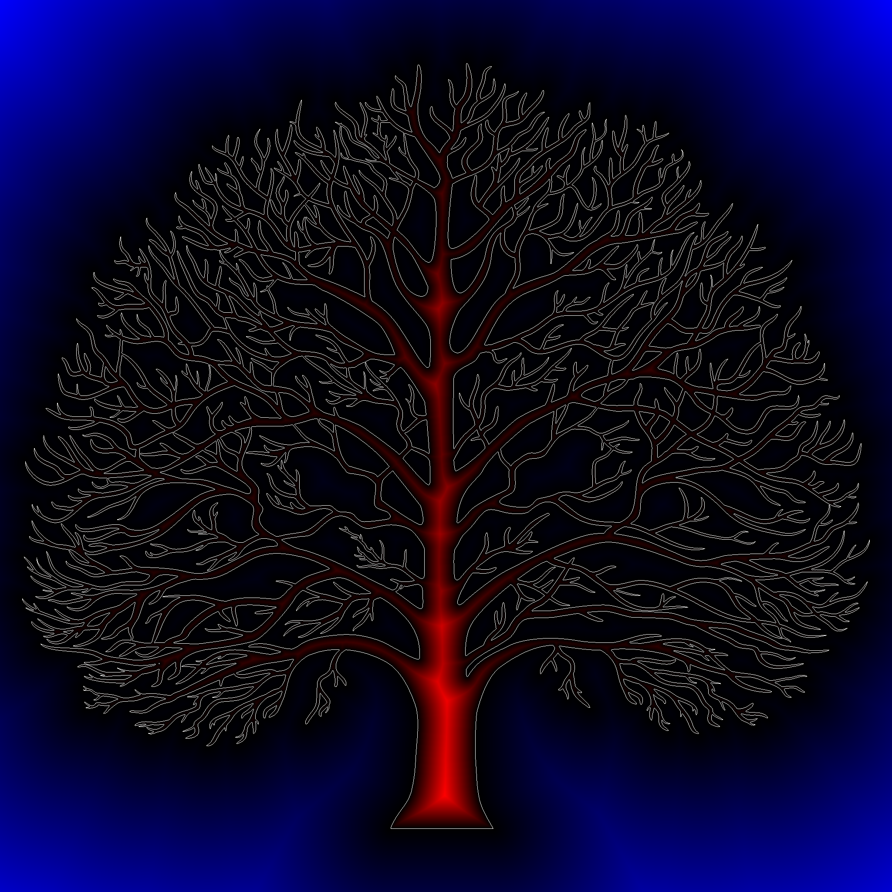
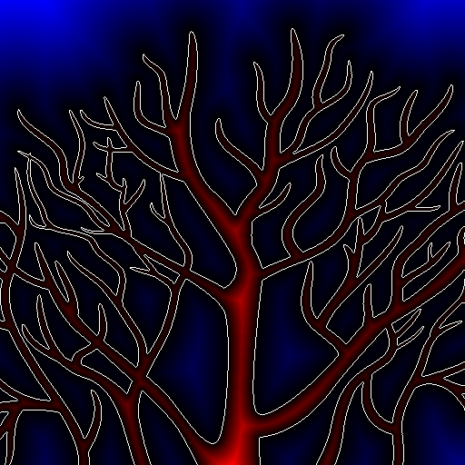
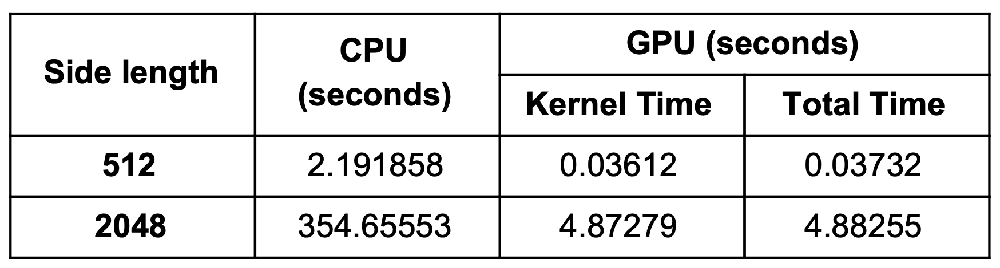

# Signed-Distance-Transform
Computing the Signed Distance Transform using CUDA.

In this project we:
* Speedup computing the Signed distance transform (SDT) on the GPU.
* Evaluate the correctness of generated results by comparing the generated images on GPU vs images generated on CPU using a serial implementation.
* Compare the GPU vs CPU execution time as a function of image size.

## Background
Signed distance transform (SDT) of a shape <em>O</em> is a field function <em>f : R2 &#10230; R</em> such that any point <em>f(x,y)</em> represents the signed shortest distance from the boundary <em>&#8706;O</em>. Points inside the shape have a positive distance value and vice versa. An SDT is quite useful in scientific computing problems such as skeleton generation, robot motion planning, and path finding. It can be seen that computing <em>f</em> at a point requires knowing the entire boundary information (thus it is a global operation).

The serial implementation we use as a baseline here computes <em>f</em> (SDT or the field function) in a brute-force fashion by first calculating distance values for a pixel with all boundary pixels and then keeping the minimum value (of magnitudes).

## Results
1. Correctness:
	* Images produced by CPU and GPU
		CPU Image              |  GPU Image
	  :-------------------------:|:-------------------------:
	    |  
	    |  

2. Execution time comparision:

	

## Execution
* Run make and set the library path: `export LD_LIBRARY_PATH=./devil/lib`.
* Execute the object file created, `./std_gpu <inputimage> <outputimage>`. 
